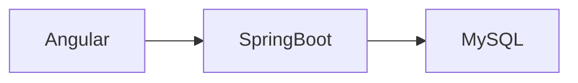

# GameHub Rentals -- Sistema de Gestión de Alquiler de Videojuegos

   

## Índice

- [Descripción](#descripción)
- [Características](#características)
- [Funcionalidades](#funcionalidades)
- [Arquitectura](#arquitectura)
- [Tecnologías](#tecnologías)
- [Objetivo del sistema](#objetivo-del-sistema)
- [Estructura del proyecto](#estructura-del-proyecto)
- [API REST](#api-rest)
- [Requisitos](#requisitos)
- [Instalación](#instalación)
- [Credenciales iniciales](#credenciales-iniciales)
- [Autores](#autores)
- [Licencia](#licencia)

## Descripción
GameHub Rentals es una aplicación web desarrollada para administrar una tienda de alquiler de videojuegos. Permite gestionar clientes, usuarios del sisteama, videojuegos, alquileres, reservas y pagos siguiendo una arquitectura cliente-servidor basada en una API REST desarrollada con Spring Boot y un frontend en Angular.
Este proyecto fue desarrollado como Trabajo Final Integrador de la carrera de Técnico Universitario en Programación. El objetivo fue aplicar principios de arquitectura cliente-servidor, desarrollo de APIs REST, autenticación con JWT, gestión de bases de datos relacionales y desarrollo de interfaces modernas con Angular.

## Características

✔ Autenticación JWT

✔ Control de stock en tiempo real

✔ Gestión de reservas

✔ Reportes administrativos

✔ Penalizaciones automáticas

✔ Arquitectura REST

✔ Roles y permisos

## Funcionalidades

### Videojuegos

- Alta
- Baja
- Modificación
- Control de stock
- Versiones por consola

### Alquileres

- Registro
- Devolución
- Penalizaciones
- Historial

### Clientes

- Alta
- Baja
- Modificación
- Bloqueo de clientes con penalizaciones.

### Usuarios
- Alta
- Baja
- Modificación
- Filtros por roles

### Reservas

- Registro
- Cancelación
- Notificaciones
- Control de disponibilidad

### Reportes

- Historial de alquileres
- Alquileres activos
- Alquileres proximos a vencer
- Alquileres realizados durante el mes
- Ingresos mensuales
- Ingresos por penalizaciones
- Promedio de ingresos por alquiler
- Videojuegos alquilados
- Videojuegos más alquilados
- Géneros más alquilados
- Plataformas más alquiladas
- Clientes con mayor actividad


## Arquitectura



## Tecnologías

### Backend

- Java 21
- Spring Boot 3
- Spring Security
- Spring Data JPA
- Hibernate
- MySQL

### Frontend

- Angular 20
- TypeScript
- RxJS
- Signals
- HTML
- CSS

### Herramientas

-   GitHub
-   Postman
-   IntelliJ IDEA / VS Code


## Objetivo del Sistema

-   Automatización del registro de alquileres.
-   Reducción de errores humanos.
-   Mejor control del stock.
-   Gestión clara de permisos y roles.
-   Base sólida para ampliaciones futuras.

## Estructura del Proyecto
```text

gamehub/
├── backend/
│   ├── auth
│   ├── config
│   ├── controllers
│   ├── model
│   ├── repositories
│   └── services
├── frontend/
│   ├── alquiler
│   ├── cuenta
│   ├── persona
│   ├── reportes
│   ├── shared
│   └── videojuego
└── README.md
```

## API REST

La aplicación expone una API REST desarrollada con Spring Boot.

Principales recursos:

- /api/videojuegos
- /api/alquileres
- /api/personas
- /api/cuentas
- /api/reservas
- /api/reportes

## Requisitos

- Java 21
- Node.js 22+
- Angular CLI
- Maven
- MySQL

## Instalación
### Backend

```bash
cd backend
./mvnw spring-boot:run
```

### Frontend

```bash
cd frontend
npm install
ng serve
```

### Base de datos

Configurar application.properties

## Credenciales iniciales

Al iniciar la aplicación se crea automáticamente un usuario con permisos de administrador.

| Usuario | Contraseña | Rol |
|----------|------------|-----|
| founder | admin123 | FOUNDER |

> El usuario FOUNDER no puede ser eliminado ni modificado.


## Autores

-   Matías Mendoza
-   Kevin Pedro Falcón
-   Nicolás Pettinelli

## Licencia

Proyecto desarrollado con fines educativos.
